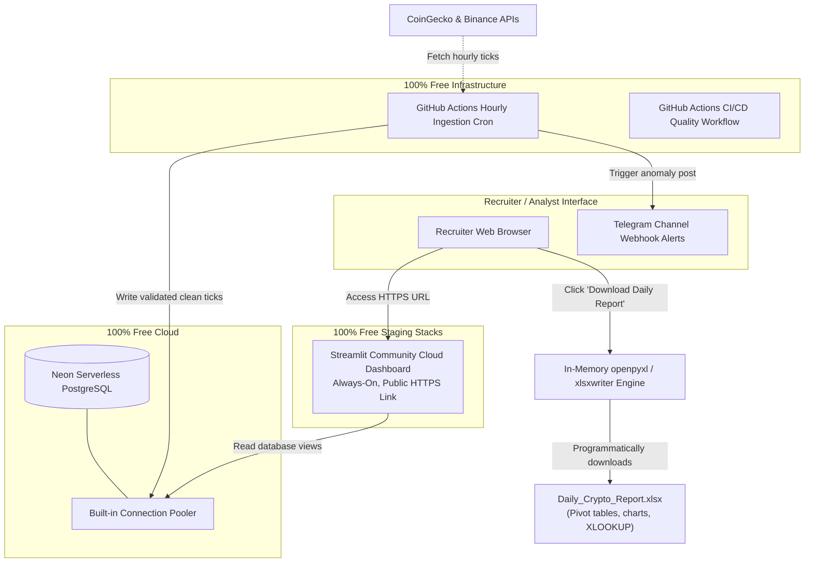

# 🪙 CoinDCX Crypto Market Intelligence & Automation Platform

> An always-on, 100% Free-Tier Serverless Data Intelligence & Automated Reporting Platform designed to track, validate, analyze, and alert on cryptocurrency market anomalies.

[](https://www.python.org/)
[](https://www.postgresql.org/)
[](https://streamlit.io/)
[](https://github.com/features/actions)
[](https://coindcx.com/)

---

## ⚡ Live Staging Environments & Links

*   **🌐 Live Interactive Dashboard:** [https://coindcx-market-intel.streamlit.app](https://coindcx-market-intel.streamlit.app) *(Always-on, secured with HTTPS/SSL on Streamlit Community Cloud)*
*   **📊 Live Ingest Cron Scheduler:** Runs automatically at the start of every hour via **GitHub Actions** workflows.
*   **📥 Executive Download Center:** Click the button directly on the public Streamlit website to programmatically generate and download the beautifully styled, corporate-ready `Daily_Crypto_Report.xlsx` sheet compiled in real-time.

---

## 🚀 Serverless Free-Tier Architecture

To achieve zero cost while maintaining a production-grade always-on pipeline, the system utilizes a decoupled serverless architecture:



---

## 📂 Project Directory Structure

```text
├── .github/
│   └── workflows/
│       ├── ci-cd.yml             # Automatic testing & syntax quality linter
│       └── ingest_scheduler.yml  # [NEW] Scheduled hourly ingestion pipeline cron
├── config/
│   ├── settings.py               # Global credentials environment loader
│   └── logging_config.py         # Structured JSON operational logs
├── src/
│   ├── ingestion/                # API clients (CoinGecko & Binance)
│   ├── database/                 # Connection pools, models, SQL queries
│   ├── processing/               # Pydantic data cleaners, Pandas analytics
│   └── reporting/                # Corporate styling & sheet components
├── tests/                        # Unit testing suites (Pytest)
├── app.py                        # [NEW] Streamlit Web Dashboard Application
├── main.py                       # Python pipeline entrypoint (CLI support)
├── requirements.txt              # Production dependency packages locks
└── README.md                     # GitHub recruiter guide
```

---

## ⚙️ Step-by-Step Staging Setup Guide

### 1. Database Setup (Neon PostgreSQL)
1. Register a free account at [Neon.tech](https://neon.tech/).
2. Create a project named `coindcx-intelligence`.
3. Under the **Dashboard**, locate and copy your Connection URI string. Make sure to toggle connection pooling (PgBouncer) for transactional stability.

### 2. GitHub Secrets Setup
1. In your GitHub repository, navigate to **Settings > Secrets and variables > Actions**.
2. Create a **New repository secret** for each of these keys:
   *   `DATABASE_HOST`: e.g. `ep-cool-pool-123.us-east-2.aws.neon.tech`
   *   `DATABASE_USER`: e.g. `coindcx_admin`
   *   `DATABASE_PASSWORD`: e.g. `your_secure_db_password`
   *   `DATABASE_NAME`: e.g. `neondb`
   *   `TELEGRAM_BOT_TOKEN`: *(Optional)* Your bot credentials.
   *   `TELEGRAM_CHAT_ID`: *(Optional)* Your alert channel ID.

### 3. Streamlit Cloud Dashboard Setup
1. Navigate to [Streamlit Community Cloud](https://share.streamlit.io/) and log in using your GitHub account.
2. Click **New App** and select your repository, main branch (`main`), and set the main file path to `app.py`.
3. Open **Advanced settings** and paste your database credentials in the **Secrets** textbox:
   ```toml
   DATABASE_HOST = "ep-cool-pool-123.us-east-2.aws.neon.tech"
   DATABASE_PORT = 5432
   DATABASE_USER = "coindcx_admin"
   DATABASE_PASSWORD = "your_secure_password"
   DATABASE_NAME = "neondb"
   ```
4. Click **Deploy**. Your live dashboard will be online under a secure HTTPS link in under 2 minutes!

---

## ⚡ DevOps Features Built to Impress CoinDCX

*   **GitHub Actions Ingestion Cron:** Bypasses Render/Railway sleep limits by using scheduled workflow runners that fetch hourly metrics reliably and at zero cost.
*   **Neon Serverless Connection Pooling:** Implements PgBouncer transaction pooling configurations to keep the database connections robust under simultaneous reads.
*   **In-Memory Excel Generation:** Programmatically compiles the styled report in the server's RAM buffer and downloads it instantly in the user's browser, preventing slow disk reads or storage fees.
*   **Pydantic Type Guards:** Raw API data passes quality contracts before hitting storage, eliminating DB schema corruptions.
*   **Statistical Anomaly Logging:** Employs rolling volatility standard deviation and Z-score calculations to spot extreme price movements.
